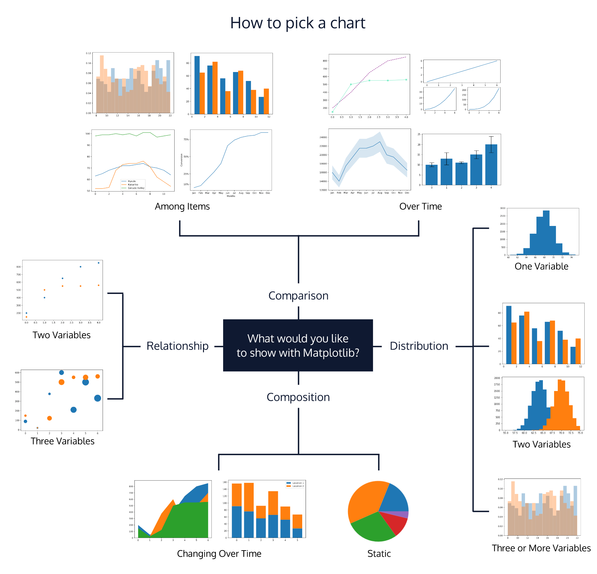

# Mr-Matplotlib
This is an exploration of how best to utilize Matplotlib amoung other visualization libraries. It is about exploring how to make the story of data come through to its full potential (Yikes!). More realistically, it is guide for me, myself, and others interested.

### Resources

## Styling

1. Marker Lines https://matplotlib.org/stable/api/markers_api.html
